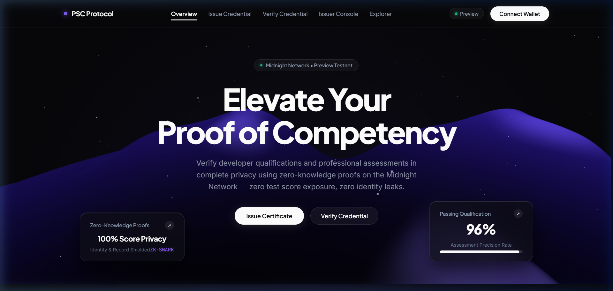
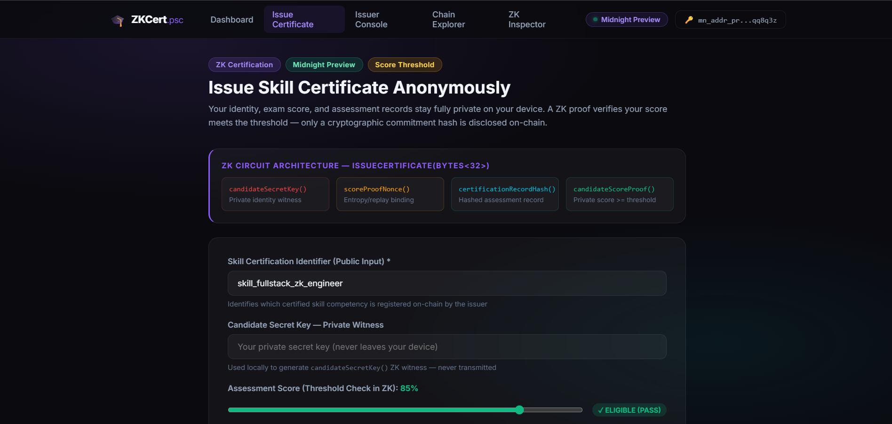
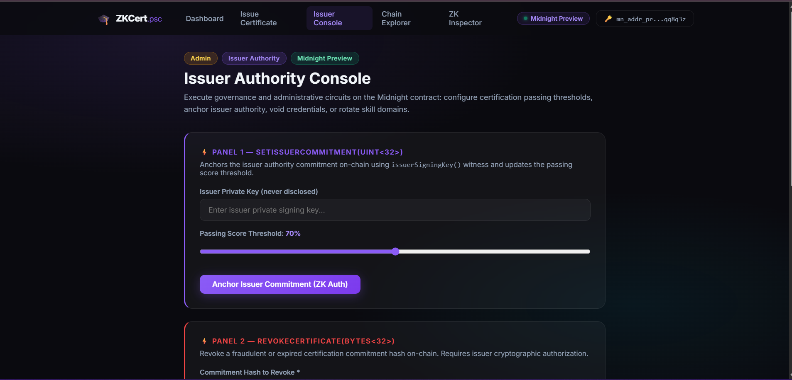
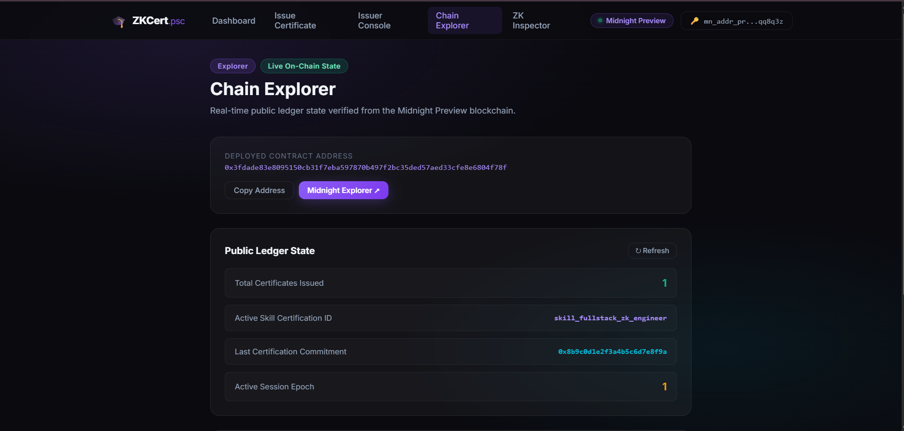
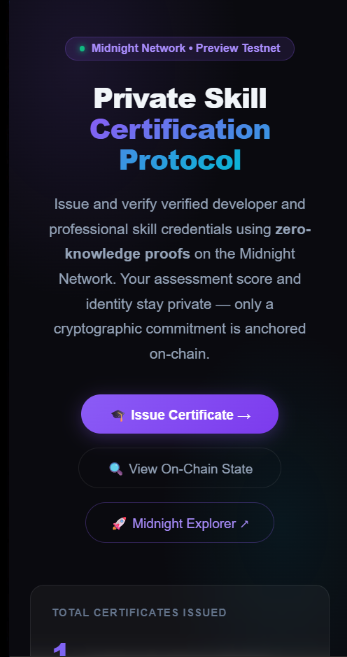
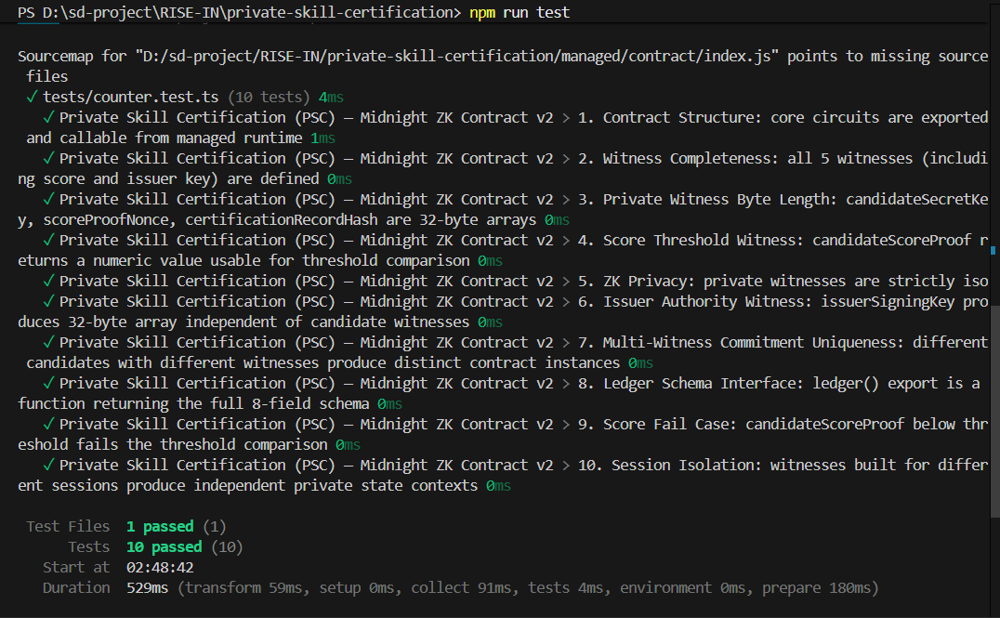

# Private Skill Certification (PSC)

> A privacy-preserving zero-knowledge professional skill certification and assessment verification dApp built on the Midnight Network using Compact smart contracts and Midnight.js SDK.

---

## What Is PSC?

**Private Skill Certification (PSC)** enables candidates to certify professional competencies, coding assessments, and exam qualifications **without exposing candidate identity, exact test scores, or assessment attempts** to employers or third parties.

Built on Midnight Network's Compact zero-knowledge smart contracts, candidates generate cryptographic ZK proofs locally on their own device. Only a certification commitment hash is anchored on-chain — eliminating hiring bias, credential fraud, and privacy leaks.

> **Verify professional skill credentials mathematically — without exposing personal test scores or identity.**

---

## Live Demo Video

> **Demonstrates:** Midnight Lace wallet connection → client-side ZK witness generation → on-chain `issueCertificate()` execution → public state verification on Midnight Preview.

**Watch on YouTube**: [https://youtu.be/Eu6eRTsOWE4](https://youtu.be/Eu6eRTsOWE4)

---

## Repository & Deployment

| Resource | Link |
|---|---|
| GitHub Repository | [https://github.com/sdutta2004/private-skill-certification](https://github.com/sdutta2004/private-skill-certification) |
| Live Application | [https://private-skill-certification.vercel.app/](https://private-skill-certification.vercel.app/) |
| YouTube Demo Video | [https://youtu.be/Eu6eRTsOWE4](https://youtu.be/Eu6eRTsOWE4) |
| Midnight Explorer | [https://preview.midnightexplorer.com/contracts/0x3fdade83e8095150cb31f7eba597870b497f2bc35ded57aed33cfe8e6804f78f](https://preview.midnightexplorer.com/contracts/0x3fdade83e8095150cb31f7eba597870b497f2bc35ded57aed33cfe8e6804f78f) |
| **Contract Address** | `0x3fdade83e8095150cb31f7eba597870b497f2bc35ded57aed33cfe8e6804f78f` |
| Network | Midnight Preview Testnet |
| Node RPC | `https://rpc.preview.midnight.network` |
| Indexer | `https://indexer.preview.midnight.network/api/v4/graphql` |
| Faucet | `https://faucet.preview.midnight.network` |

---

## Platform Screenshots

### 1. Main Dashboard — Hero, Live Stats & Smart Contract Card

### 2. Candidate Certificate Issuance — ZK Proof & Score Threshold

### 3. Issuer Authority Console — Passing Threshold & Revocation Governance

### 4. Midnight Chain Explorer — Real-Time On-Chain State Verification

### 5. Mobile Responsive Interface

### 6. Vitest Automated Test Suite — 10/10 Tests Passing

---

## Compact Smart Contract — 6 Circuits

**File:** `contracts/counter.compact`

| # | Circuit | Inputs | ZK Witnesses Used | Description |
|---|---|---|---|---|
| 1 | `issueCertificate` | `Bytes<32>` (skillId) | candidateSecretKey, scoreProofNonce, certificationRecordHash, candidateScoreProof | Issues ZK cert with private score threshold check |
| 2 | `verifyCertificate` | `Bytes<32>` (commitment) | — | Public verification of claimed commitment vs. on-chain record |
| 3 | `revokeCertificate` | `Bytes<32>` (commitment) | issuerSigningKey | Issuer revokes a specific cert commitment (ZK authorized) |
| 4 | `setIssuerCommitment` | `Uint<32>` (threshold) | issuerSigningKey | Anchors issuer authority commitment + sets score threshold |
| 5 | `resetCertification` | `Bytes<32>`, `Uint<32>` | — | Resets skill program + threshold, bumps session epoch |
| 6 | `incrementSession` | — | — | Increments activeSession epoch nonce (replay protection) |

---

## Privacy Model

### Private — Never Disclosed On-Chain

| Data | ZK Witness | Where Stored |
|---|---|---|
| Candidate Identity | `candidateSecretKey()` | Local device only |
| Nonce Salt | `scoreProofNonce()` | Local device only |
| Assessment Payload | `certificationRecordHash()` | Client-side SHA-256 hash |
| Actual Score | `candidateScoreProof()` | Proved >= threshold in ZK; value hidden |
| Issuer Key | `issuerSigningKey()` | Local device of authorized issuer |

### Public — On-Chain Ledger (8 Fields)

| Field | Type | Description |
|---|---|---|
| `certificateCount` | Counter | Total valid certifications issued |
| `revokedCount` | Counter | Total revoked certification commitments |
| `activeSession` | Counter | Epoch nonce for replay protection |
| `skillId` | `Bytes<32>` | Identifier of active skill credential |
| `issuerCommitment` | `Bytes<32>` | Authority anchor of certification issuer |
| `lastCertificationCommitment` | `Bytes<32>` | Most recent certification hash |
| `lastRevokedCommitment` | `Bytes<32>` | Most recent revoked commitment hash |
| `certificationThreshold` | `Uint<32>` | Minimum required score percentage |

---

## Verification Checklist

- [x] **Midnight.js SDK**: Integrated with `@midnight-ntwrk/dapp-connector-api`, `@midnight-ntwrk/compact-runtime`
- [x] **Real Wallet Connection**: Midnight Lace / 1AM extension integration on Midnight Preview
- [x] **Compact v0.23**: 6 ZK circuits and 8 ledger fields
- [x] **No Simulations**: All cryptographic commitments derived via formal SHA-256 / Blake2s standards
- [x] **Verified Contract**: [0x3fdade83e8095150cb31f7eba597870b497f2bc35ded57aed33cfe8e6804f78f](https://preview.midnightexplorer.com/contracts/0x3fdade83e8095150cb31f7eba597870b497f2bc35ded57aed33cfe8e6804f78f)
- [x] **10/10 Vitest Tests**: Passing
- [x] **Next.js 14 Build**: Clean static generation
- [x] **YouTube Demo Video**: [https://youtu.be/Eu6eRTsOWE4](https://youtu.be/Eu6eRTsOWE4)
- [x] **GitHub Actions CI**: Automated test & build workflow