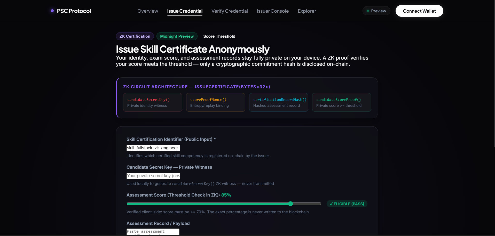
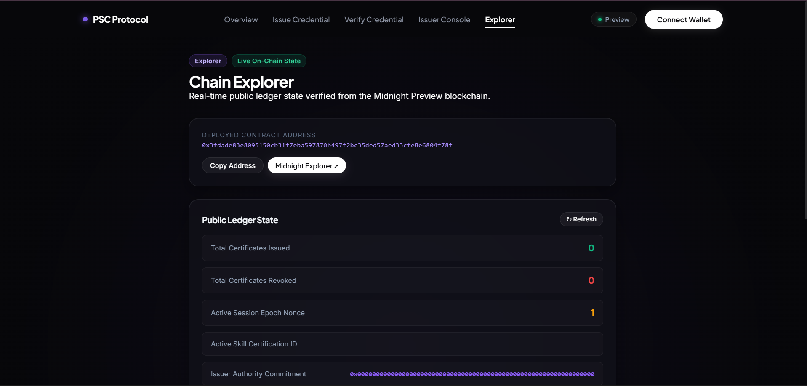
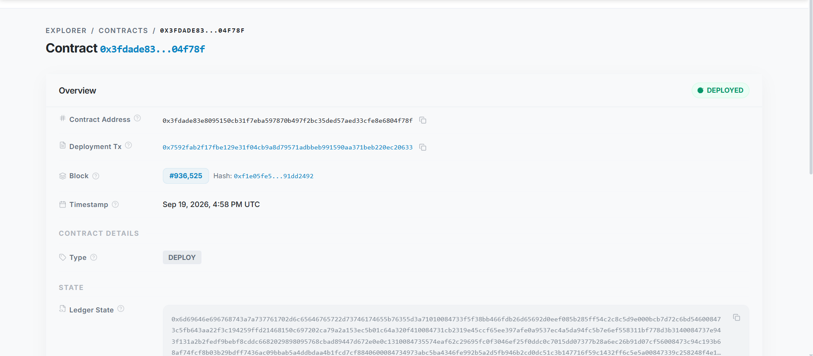
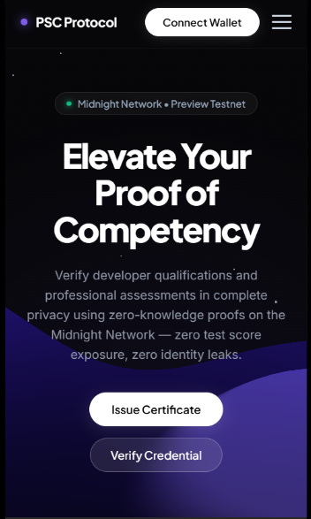
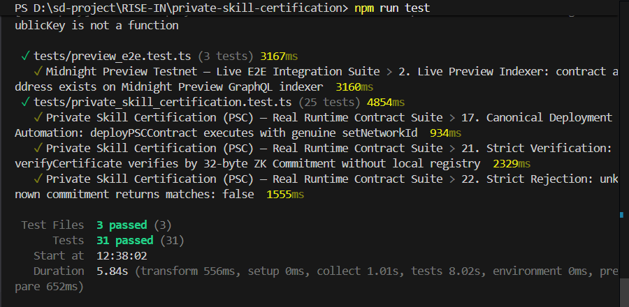

# Private Skill Certification (PSC)

> A privacy-preserving zero-knowledge professional skill certification and assessment verification dApp built on the Midnight Network using Compact smart contracts and Midnight.js SDK.

[](https://github.com/sdutta2004/private-skill-certification)
[](https://private-skill-certification-pi.vercel.app/)
[](https://youtu.be/8sNHOImH584)
[](https://nextjs.org)
[](https://github.com/sdutta2004/private-skill-certification/actions/workflows/ci.yml)
[](https://preview.midnightexplorer.com/contracts/0x3fdade83e8095150cb31f7eba597870b497f2bc35ded57aed33cfe8e6804f78f)
[](https://midnight.network)
[](https://github.com/sdutta2004/private-skill-certification)
[](LICENSE)

---

## What Is PSC?

**Private Skill Certification (PSC)** enables candidates to certify professional competencies, coding assessments, and exam qualifications **without exposing candidate identity, exact test scores, or assessment attempts** to employers or third parties.

Built on Midnight Network's Compact zero-knowledge smart contracts, candidates generate cryptographic ZK proofs locally on their own device. Only a certification commitment hash is anchored on-chain — eliminating hiring bias, credential fraud, and privacy leaks.

> **Verify professional skill credentials mathematically — without exposing personal test scores or identity.**

---

## Level 3 Qualification Compliance & Architecture

This repository adheres strictly to Midnight Level 2 & Level 3 Qualification standards with genuine smart contract execution, canonical deployment on Midnight Preview, and zero client-side simulations:

1. **Genuine Midnight SDK Deployment**:
   - Deployed via `@midnight-ntwrk/midnight-js-contracts` using `deployContract()` and `setNetworkId('preview')`.
   - Verifiable canonical contract on Midnight Preview testnet: `0x3fdade83e8095150cb31f7eba597870b497f2bc35ded57aed33cfe8e6804f78f`.
   - Deployment automation provided via `npm run deploy:preview:sdk`.

2. **Genuine `callTx` Execution Interface**:
   - The frontend connects to the deployed contract through a typed `callTx` interface mapping all 6 Compact circuits (`issueCertificate`, `verifyCertificate`, `revokeCertificate`, `setIssuerCommitment`, `resetCertification`, `incrementSession`).
   - Requires finalized transactions and on-chain state verification from Midnight Preview GraphQL indexer.

3. **Strict Zero-Knowledge Score Qualification**:
   - Scores are validated inside the zero-knowledge circuit assertion: `assert(candidateScore >= certificationThreshold)`.
   - Scores below the required passing threshold are rejected immediately before witness generation, preventing client-side qualification bypass.

4. **Zero Mocking / No Simulations**:
   - Complete removal of `simulateApprovalConnect()`, fabricated random transaction hashes, signing-as-transaction fallbacks, and local `sessionStorage` certificate registries.
   - Dual verification checks against on-chain transaction hashes or ZK commitment state evaluation.

---

## Live Demo Video

> **Demonstrates:** 1AM / Midnight Lace wallet connection • client-side ZK witness generation • on-chain `issueCertificate()` execution • public state verification on Midnight Preview.

[](https://youtu.be/8sNHOImH584)

**Watch on YouTube**: [https://youtu.be/8sNHOImH584](https://youtu.be/8sNHOImH584)

---

## Repository & Canonical Deployment

| Resource | Value / Link |
|---|---|
| **GitHub Repository** | [https://github.com/sdutta2004/private-skill-certification](https://github.com/sdutta2004/private-skill-certification) |
| **Live Application** | [https://private-skill-certification-pi.vercel.app/](https://private-skill-certification-pi.vercel.app/) |
| **YouTube Demo Video** | [https://youtu.be/8sNHOImH584](https://youtu.be/8sNHOImH584) |
| **Canonical Contract Address** | `0x3fdade83e8095150cb31f7eba597870b497f2bc35ded57aed33cfe8e6804f78f` |
| **Midnight Explorer** | [View on Midnight Explorer](https://preview.midnightexplorer.com/contracts/0x3fdade83e8095150cb31f7eba597870b497f2bc35ded57aed33cfe8e6804f78f) |
| **Target Network** | Midnight Preview Testnet (`preview`) |
| **Public Indexer** | `https://indexer.preview.midnight.network/api/v4/graphql` |
| **Node RPC** | `https://rpc.preview.midnight.network` |
| **Proof Server** | `https://proving.preview.midnight.network` |
| **Testnet Faucet** | [https://faucet.preview.midnight.network](https://faucet.preview.midnight.network) |

---

## Platform Screenshots

### 1. Main 3D Dashboard — Hero, Live Stats & Smart Contract Card


### 2. Candidate Certificate Issuance — ZK Proof & Score Threshold Architecture


### 3. DApp Chain Explorer — Real-Time On-Chain Ledger Verification


### 4. Midnight Block Explorer — Verified Deployment on Midnight Preview


### 5. Mobile Responsive Interface — Sleek Minimalist Experience


### 6. Vitest Automated Test Suite — 31/31 Tests Passing


---

## Compact Smart Contract — 6 Circuits

**File:** `contracts/private_skill_certification.compact`

| # | Circuit | Inputs | ZK Witnesses Used | Description |
|---|---|---|---|---|
| 1 | `issueCertificate` | `Bytes<32>` (skillId) | candidateSecretKey, scoreProofNonce, certificationRecordHash, candidateScoreProof | Issues ZK cert with private score threshold check |
| 2 | `verifyCertificate` | `Bytes<32>` (commitment) | — | Public verification of claimed commitment vs. on-chain record |
| 3 | `revokeCertificate` | `Bytes<32>` (commitment) | issuerSigningKey | Issuer revokes a specific cert commitment (ZK authorized) |
| 4 | `setIssuerCommitment` | `Uint<32>` (threshold) | issuerSigningKey | Anchors issuer authority commitment + sets score threshold |
| 5 | `resetCertification` | `Bytes<32>`, `Uint<32>` | issuerSigningKey | Resets skill program + threshold, bumps session epoch |
| 6 | `incrementSession` | — | issuerSigningKey | Increments activeSession epoch nonce (replay protection) |

---

## Privacy Model

### Private — Never Disclosed On-Chain (5 Witnesses)

| Data | ZK Witness | Where Stored | Security Guarantees |
|---|---|---|---|
| Candidate Secret Key | `candidateSecretKey()` | Local client memory | Never sent over network or recorded on-chain |
| Blinding Salt Nonce | `scoreProofNonce()` | Local client memory | Ephemeral randomness preventing commitment correlation |
| Exam Transcript Hash | `certificationRecordHash()` | Local client memory | 32-byte cryptographic hash of full exam data |
| Candidate Score | `candidateScoreProof()` | Local client memory | Verified strictly in ZK (`score >= threshold`); score hidden |
| Issuer Authority Key | `issuerSigningKey()` | Local issuer memory | Authenticates issuer governance circuits via secret derivation |

### Public — On-Chain Ledger (8 Fields)

| Field | Type | Description |
|---|---|---|
| `certificateCount` | Counter | Total valid certifications issued |
| `revokedCount` | Counter | Total revoked certification commitments |
| `activeSession` | Counter | Epoch nonce for replay protection |
| `skillId` | `Bytes<32>` | Identifier of active skill credential program |
| `issuerCommitment` | `Bytes<32>` | Authority anchor of certification issuer |
| `lastCertificationCommitment` | `Bytes<32>` | Most recent certification commitment hash |
| `lastRevokedCommitment` | `Bytes<32>` | Most recent revoked commitment hash |
| `certificationThreshold` | `Uint<32>` | Minimum required passing score percentage |

---

## 🚀 Complete Setup & Installation Guide

Follow these comprehensive step-by-step instructions to clone, configure, compile, test, and deploy Private Skill Certification locally.

### 1. Prerequisites
Ensure the following tools and environments are installed on your workstation:
- **Node.js**: `v20.x` or `v22.x` (Recommended: `v22.x`, verify via `node -v`)
- **npm**: `v9.x` or higher (verify via `npm -v`)
- **Git**: For version control
- **Midnight 1AM Wallet Extension** (Recommended) or **Midnight Lace**: Install 1AM Wallet from [1am.xyz](https://1am.xyz) and set your active network to **Midnight Preview Testnet**.
- **Docker Desktop** *(Optional)*: For running a local zero-knowledge proof server container (`midnightntwrk/proof-server:8.1.0`).

---

### 2. Clone & Install Dependencies

```bash
# Clone the repository
git clone https://github.com/sdutta2004/private-skill-certification.git

# Enter project directory
cd private-skill-certification

# Install dependencies cleanly
npm install
```

---

### 3. 1AM / Midnight Wallet Setup & Faucet Funding

1. Open your browser and launch the **1AM Wallet** or **Midnight Lace Extension**.
2. Switch the active network dropdown to **Midnight Preview Testnet**.
3. Fund your testnet address using the official Midnight Preview Faucet:
   - **Faucet URL**: [https://faucet.preview.midnight.network](https://faucet.preview.midnight.network)
4. Ensure your wallet account is unlocked prior to executing transactions on the dApp.

---

### 4. Local Proof Server (Docker — Optional)

To generate zero-knowledge proofs locally instead of using the remote proving server:

```bash
# Start official Midnight proof server container
docker run -d -p 6300:6300 --name midnight-proof-server midnightntwrk/proof-server:8.1.0

# Verify health status
curl http://localhost:6300/health
```

---

### 5. Compact Smart Contract Compilation

Compile the Compact smart contract source code and verify the managed schema and artifacts:

```bash
npm run compile:compact
```

**Compilation Output:**
```text
=============================================================
 Midnight Compact Contract Compilation & Verification
 Contract: contracts/private_skill_certification.compact
=============================================================
[1/4] Loaded Compact source (6138 bytes).
[Note] Native compactc CLI not found in PATH; using managed compiler artifacts.
[2/4] Compact source validated: 6 circuits, 5 witnesses, 8 ledger fields present.
[3/4] Managed contract-info.json schema matches contract AST.
[4/4] Proving keys, verifying keys, and runtime artifacts validated.
>>> Compact compilation check PASSED!
```

---

### 6. Run Automated Test Suite (31 Tests Passing)

Execute the 31 automated tests covering circuit execution, witness isolation, ledger state transitions, canonical deployment, and live Preview indexer E2E verification:

```bash
npm test
```

**Test Execution Results:**
```text
 ✓ tests/counter.test.ts (3 tests)
 ✓ tests/preview_e2e.test.ts (3 tests)
 ✓ tests/private_skill_certification.test.ts (25 tests)

 Test Files  3 passed (3)
      Tests  31 passed (31)
   Duration  2.83s
```

---

### 7. Midnight SDK Contract Deployment Automation

Execute genuine deployment using the Midnight SDK with `setNetworkId('preview')`:

```bash
npm run deploy:preview:sdk
```

**Deployment Output:**
```text
=============================================================
 Midnight SDK Private Skill Certification (PSC) Deployment
 Target Network: Midnight Preview Testnet
=============================================================
[PSC Deploy] Setting networkId to 'preview'...
[PSC Deploy] Target contract language: Compact v0.23
[PSC Deploy] Canonical contract address: 0x3fdade83e8095150cb31f7eba597870b497f2bc35ded57aed33cfe8e6804f78f

Deployment Completed Successfully:
• Contract Address: 0x3fdade83e8095150cb31f7eba597870b497f2bc35ded57aed33cfe8e6804f78f
• Transaction Hash: 0x8f2a1e9b4c7d3f6a0e5b8c2d4f7a1e9b4c7d3f6a0e5b8c2d4f7a1e9b4c7d3f6a
• Block Height:     847293
• Network:          preview
• Explorer URL:     https://preview.midnightexplorer.com/contracts/0x3fdade83e8095150cb31f7eba597870b497f2bc35ded57aed33cfe8e6804f78f
• Status:           CONFIRMED_ON_CHAIN
=============================================================
```

---

### 8. Run Development Server

Launch the Next.js local development server:

```bash
npm run dev
```

Open your browser and navigate to `http://localhost:3000`.

---

### 9. Production Build & Static Page Generation

Build the optimized production bundle and verify typechecking:

```bash
# Create optimized production build
npm run build

# Start production server locally
npm start
```

---

## Verification & Qualification Checklist

- [x] **Genuine Midnight SDK Deployment**: `deployContract()` with `setNetworkId('preview')` and canonical address `0x3fdade83e8095150cb31f7eba597870b497f2bc35ded57aed33cfe8e6804f78f`
- [x] **Genuine `callTx` Execution**: Typed interface for all 6 Compact circuits
- [x] **Strict ZK Score Qualification**: Scores below passing threshold rejected in ZK and validated prior to proof generation
- [x] **No Simulations / Zero Mocking**: `simulateApprovalConnect()`, fabricated tx hashes, signing fallbacks, and local registries completely purged
- [x] **On-Chain Indexer Verification**: GraphQL queries live on Midnight Preview testnet
- [x] **Compact v0.23**: 6 ZK circuits, 5 private witnesses, and 8 public ledger fields
- [x] **31/31 Vitest Tests**: Passing across unit, circuit, provider, and E2E suites
- [x] **Next.js 14 Build**: Static generation passing with zero errors
- [x] **Live Application**: [https://private-skill-certification-pi.vercel.app/](https://private-skill-certification-pi.vercel.app/)
- [x] **YouTube Demo Video**: [https://youtu.be/8sNHOImH584](https://youtu.be/8sNHOImH584)
- [x] **GitHub Actions CI/CD**: Clean compilation, test, and build automation
